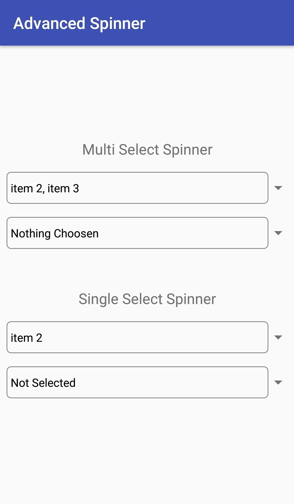
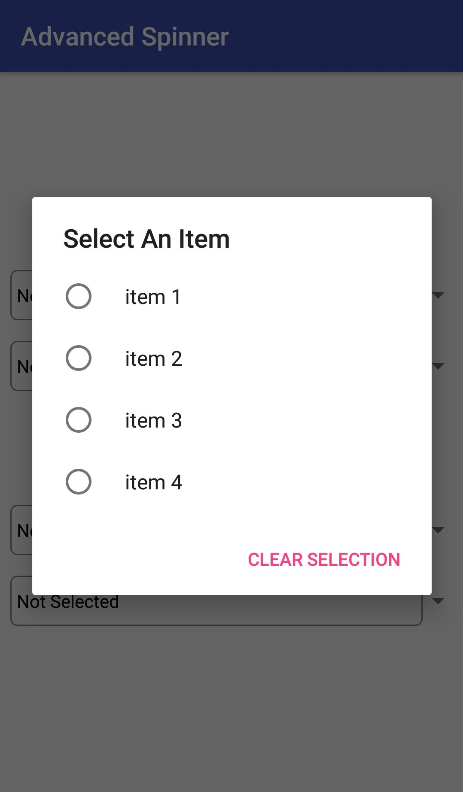
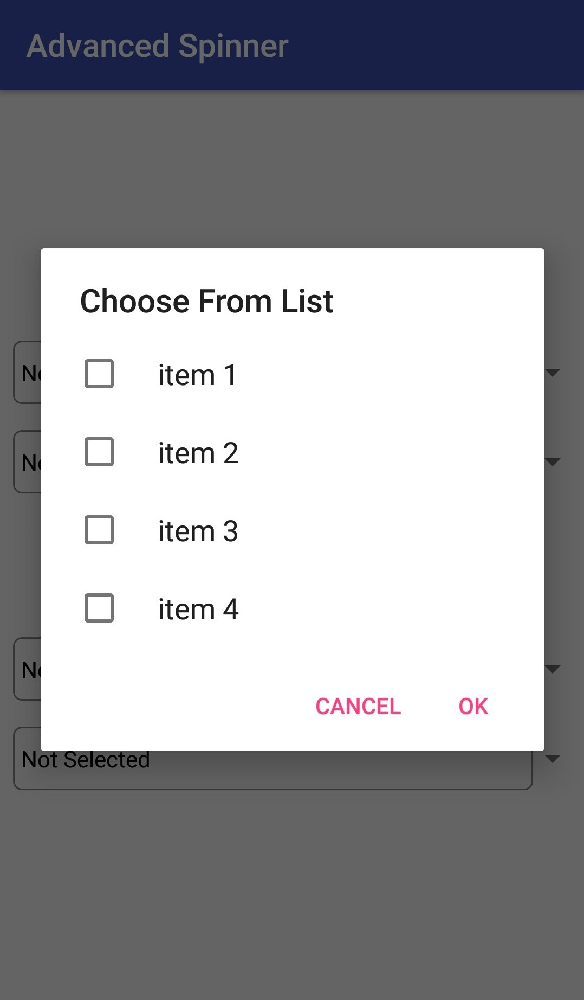

# Advanced Spinner [](https://jitpack.io/#Liocoder24x7/Advanced-Spinner) [](https://opensource.org/licenses/Apache-2.0)

Advanced Spinner is an Android Library that provides a Multiple Selection Spinner and various functions/alterations to it. Also, Single Selection Spinner is there.

## Installation

### Add this to root build.gradle file(Project level) at the end of repositories

```
allprojects {
	repositories {
		...
		maven { url 'https://jitpack.io' }
	}
}
```

### Add this to the dependencies at module level build.gradle

```
implementation 'com.github.Liocoder24x7:Advanced-Spinner:v1.0'
```
## Screenshots

      

## Changes from v0.4 to v1.0
* 'hintText' attribute changed to 'titleText'
* 'spinnerLayout' attribute included(setLayout(int) for java)
* getSelectedItems() method in MultiSpinner
* Bugfixes and other code changes


## Usage

* Create SingleSpinner or MultiSpinner objects respectively.

### Common functions for Spinners

* Give a heading to the dialog of list of items in spinner,
```
app:hintText="Choose From List"
    or
spinnerObject.setSpinnerTitle(title);
```
* To set list of items as spinner dialog list,
```
app:entries="@array/array_list"
    or
spinnerObject.setSpinnerList(list);
```
* To set custom layout for the spinner,
```
app:spinnerLayout="@layout/spinner_layout"
    or
spinnerObject.setlayout(R.layout.spinner_layout);
```
* Deselect all selections,
```
spinnerObject.selectNone();
```
### Implementing Single Choice Spinner

* To get the selected item from spinner, (returns -1 if none selected)
```
String choice=spinnerObject.getSelectedItem();
```
* To get selected item position among the list, (returns null if none selected)
```
int position=spinnerObject.getSelected();
```
* To set an item as selected, (throws error if position > size of list)
```
spinnerObject.setSelected(position);
```

* Listener for choice in spinner, (triggers whenever an item is choosen)
```
spinnerObject.addOnItemChoosenListener(new SpinnerListener() {
    @Override
    public void onItemChoosen(String item, int position) {
        //'item' is the selected item
        //'position' is the position of the item in the original list
    }
});
```

### Implementing Multiple Choice Spinner

* To get selected items from spinner in the form of a string separated with comma(,) (returns blank if none selected)
```
String items=spinnerObject.getAdapterText();
```
* To get selected items from spinner in the form of a list of string (returns blank if none selected)
```
ArrayList<String> items=spinnerObject.getSelectedItems();
```
* To get selected item positions among the list, (returns boolean array with true for selected positions and false for others)
```
boolean[] selected=spinnerObject.getSelected();
```
* To set the list of selections pass a boolean array of selected positions as true, (throws error if array length != size of list)
```
spinnerObject.setSelected(choice_array);
```

* Listener for choice in spinner, (triggers whenever an item is choosen)
```
spinnerObject.addOnItemsSelectedListener(new MultiSpinnerListener() {
    @Override
    public void onItemsSelected(List<String> choices, boolean[] selected) {
        //'choices' is the selected item's list
        //'selected' is the array where selected item positions has a true value else false
    }
});
```
## Contributing
Pull requests are welcome. For major changes, please open an issue first to discuss what you would like to change.

Please make sure to update tests as appropriate.

## License

Copyright [2018] [Sayantan]

Licensed under the Apache License, Version 2.0 (the "License");
you may not use this file except in compliance with the License.
You may obtain a copy of the License at

    http://www.apache.org/licenses/LICENSE-2.0

Unless required by applicable law or agreed to in writing, software
distributed under the License is distributed on an "AS IS" BASIS,
WITHOUT WARRANTIES OR CONDITIONS OF ANY KIND, either express or implied.
See the License for the specific language governing permissions and
limitations under the License.
